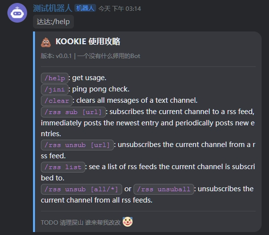
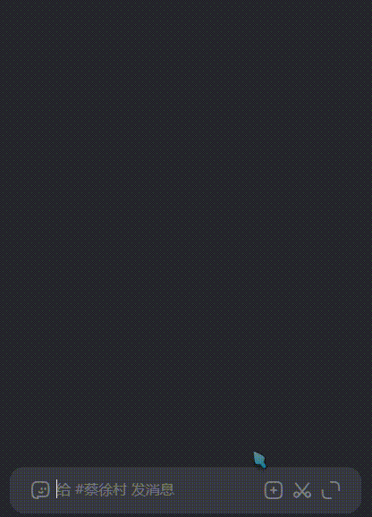

<h1 align="center">🚧Zakook Bot🚧</h1>

<!-- <div align="center">

  [](https://github.com/jonatasemidio/multilanguage-readme-pattern/blob/master/README.md)
</div> -->

<p align="center">
  
</p>
<div align="center">

[](https://www.kookapp.cn/)
[](https://www.kookapp.cn/)
[](https://hub.docker.com/r/dadahsueh/zakook-bot)
[](https://github.com/dadahsueh/zakook-bot/commits/main/)
[](https://github.com/dadahsueh/zakook-bot)

</div>

> - TODOs
>   - [ ] channel logging
>   - [ ] fix concurrency
---

<p align="center"> 🤖 Simple template KOOK bot. Doesn't do much, does do RSS.
  <br> 
</p>

## 📝 Table of Contents

- [About](#about)
- [Usage](#usage)
- [Getting Started](#getting_started)
- [Deploying your own bot](#deployment)
- [Acknowledgments](#acknowledgement)
- [Resources](#resources)

## 🧐 About <a name = "about"></a>

<p align="left">
  
  
</p>

For educational purposes. ~~Good clean code~~. The bot is intended for Kook, can subscribe to RSS feeds, and ~~
definitely~~ ~~probably~~ ~~plausibly~~ maybe scalable. Uses [`Python v3.11.9`](https://www.python.org/downloads/)
and [khl.py](https://github.com/TWT233/khl.py).

- [`bot/commands`](bot/commands) - bot command code
- [`bot/databases`](bot/databases) - database code
- [`bot/messages`](bot/messages) - messages and card messages template
- [`bot/tasks`](bot/tasks) - bot tasks code
- [`bot/utils`](bot/utils) - utility code

<br>
<br>

## 🎈 Usage <a name = "usage"></a>

To begin exploring:

```
/help
```

### Commands

- `/help`: get usage.
- `/jini`: ping pong check.
- `/clear`: clears all messages of a text channel.
- `/rss sub [url]`: subscribes the current channel to a rss feed, immediately posts the newest entry and periodically
  posts new entries.
- `/rss unsub [url]`: unsubscribes the current channel from a rss feed.
- `/rss list`: see a list of rss feeds the current channel is subscribed to.
- `/rss unsub [all/*]` or `/rss unsuball`: unsubscribes the current channel from all rss feeds.
- `/rss dump`: dumps all rss links.

## 1️⃣ Getting Started <a name = "getting_started"></a>

These instructions will get you a copy of the project up and running on your ***local*** machine for development and
testing

### Prerequisites

If you need to clone the repo

```
git clone https://github.com/dadahsueh/zakook-bot.git
cd zakook-bot
mv .env.template .env
```

If you do not see a **.env** file just manually rename `.env.template` to `.env` and or create one with `touch .env`.
Then configure the `.env` as like below (substituting for your values).
You could also run with `python main.py -t YOUR_TOKEN`.

```
TOKEN=BOT_TOKEN_HERE

CONTAINER_NAME=zakook-bot-runner

ADMIN_USERS=["635507656"]

BOT_NAME=ZAKOOK

BOT_VERSION=v0.0.1

MUSIC_STATUS=["(私人笑声);赛马娘", ";"]

CF=
```

### Installing

1. Create Python virtual environment or just `python -m venv venv`

```
virtualenv venv
```

2. **Windows POSH** activate venv

```
./venv/Scripts/activate
```

2. **Linux / Mac**  activate venv

```
source venv/bin/activate
```

3. Install dependencies

```
pip install -r requirements.txt
```

4. Annnnnnnnnnd run 🎊

```
python main.py
```

You can also try running with arguments `-t TOKEN` or `--token TOKEN`, and `-v` `-vv` for verbosity changes. Which would
look like `python main.py -t TOKEN -vv`

Also also try `-cf https://xxxworker.xxxname.workers.dev/` to configure a [Cloudflare Worker](README.Worker.md)

## 🚀 Deploying your own bot <a name = "deployment"></a>

### [Docker README](README.Docker.md) <sup><--Goooo.</sup>
### [Cloudflare Worker README](README.Worker.md) <sup><--For RSSHub.</sup>

<br>

## 🎉 Acknowledgements <a name = "acknowledgement"></a>

- [khl.py: Python SDK for KOOK API](https://github.com/TWT233/khl.py)
- [Kook-Source-Query Bot](https://github.com/NyaaaDoge/kook-source-query)
- [Kyouka 镜华 点歌机器人](https://github.com/shuyangzhang/Kyouka/)

## 💭 Resources <a name = "resources"></a>

- [khl.py Docs](https://khl-py.eu.org/)
- [khl.py Examples](https://github.com/TWT233/khl.py/blob/main/example/README.md)
- [Emojisearch](https://www.emojisearch.app/)
- [Emoji Cheat Sheet](https://www.webfx.com/tools/emoji-cheat-sheet/)
- [RSSHub 万物皆可 RSS](https://docs.rsshub.app/zh/)
